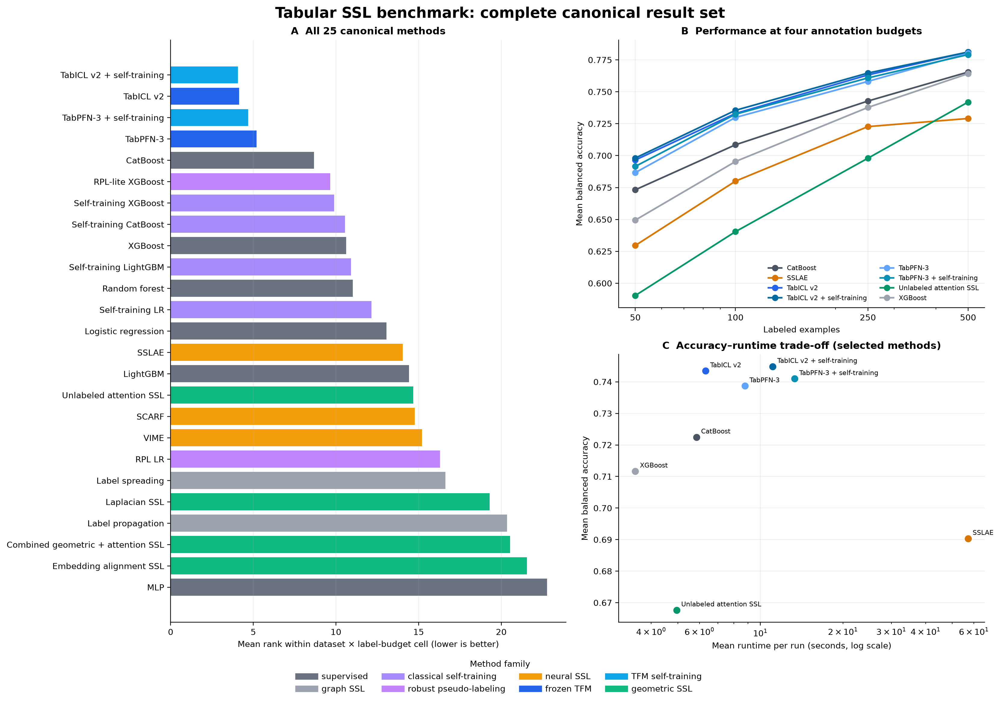

# Tabular foundation models for semi-supervised learning

A reproducible study of supervised learning, classical and neural
semi-supervised learning (SSL), and tabular foundation models when labels are
scarce. The repository contains the full benchmark implementation, immutable
canonical results, publication figures, validation records, cluster tooling,
and the final supervisor-ready report.

> **Status: complete.** The canonical benchmark contains 3,000 runs covering
> 25 methods, 10 OpenML datasets, four label budgets, and three fixed seeds.
> All 960 runs in the foundation-model and focused-SSL phases succeeded. The 24
> failures in the historical wave are retained transparently rather than
> deleted or imputed.

[Read the three-page report](results/reports/bar_ilan_tfm_ssl_final/three_page_brief/tabular_foundation_models_report.pdf)
· [Detailed results](docs/RESULTS.md)
· [Method definitions](docs/METHODS.md)
· [Architecture](docs/ARCHITECTURE.md)
· [Reproduction guide](docs/REPRODUCIBILITY.md)
· [References](docs/REFERENCES.md)



The left panel ranks every evaluated method within each of the 40 shared
dataset × budget cells and then averages those ranks, giving each benchmark
cell equal weight. A failed cell receives rank 26, one below the worst possible
successful rank. Balanced accuracy is the primary metric throughout.

## Every method, budget, and dataset


This matrix is the exhaustive visual comparison. Every one of the 25 canonical
methods appears once, ordered by the complete-grid ranking. Panel A reports mean
balanced accuracy at all four label budgets; a dagger marks incomplete
historical graph-SSL coverage. Panel B shows the method's mean rank on every
dataset, averaged over the four budgets, with failed cells assigned rank 26.
The exact plotted values are available in
[`all_methods_by_budget.csv`](results/reports/github_overview/all_methods_by_budget.csv)
and [`all_methods_by_dataset.csv`](results/reports/github_overview/all_methods_by_dataset.csv).

## Main findings

- The four foundation-model configurations occupy the first four positions in
  the complete 25-method ranking. `tabiclv2_self_training` is first, with mean
  balanced accuracy **0.745** and mean cell rank **4.06**.
- Frozen TabICL v2 and TabPFN-3 are already strong: **0.743** and **0.739** mean
  balanced accuracy. Validation-guarded self-training adds only **+0.0014** and
  **+0.0023**, respectively, and usually falls back to the frozen prediction.
- Among the focused trainable SSL methods, unlabeled retrieval attention is the
  strongest (**0.668**). Combining retrieval, Laplacian, pseudo-label, and
  alignment losses does not improve on attention alone.
- A foundation-model variant wins 31 of 40 cells against six selected historical
  comparators. This supports using frozen TFMs as the serious baseline under
  label scarcity; it does **not** imply that pseudo-labeling is uniformly useful.
- The final focused grid is operationally clean: 960/960 successful runs, no
  missing or duplicate keys, finite primary metrics, and no validation/test
  examples in training graphs or retrieval memory.

## Complete canonical ranking

Mean balanced accuracy is computed from successful runs. Mean cell rank is the
failure-aware, equal-cell-weight comparison described above. The machine-readable
table also contains coverage, runtime, dispersion, and failure counts:
[`all_method_summary.csv`](results/reports/github_overview/all_method_summary.csv).

| Rank | Method | Family | Mean BA | Mean cell rank ↓ | Successful runs |
|---:|---|---|---:|---:|---:|
| 1 | `tabiclv2_self_training` | TFM self-training | 0.745 | 4.06 | 120/120 |
| 2 | `tabiclv2` | frozen TFM | 0.743 | 4.14 | 120/120 |
| 3 | `tabpfn3_self_training` | TFM self-training | 0.741 | 4.69 | 120/120 |
| 4 | `tabpfn3` | frozen TFM | 0.739 | 5.19 | 120/120 |
| 5 | `catboost` | supervised | 0.722 | 8.66 | 120/120 |
| 6 | `rpl_lite_xgboost` | robust pseudo-labeling | 0.716 | 9.66 | 120/120 |
| 7 | `self_training_xgboost` | classical self-training | 0.716 | 9.89 | 120/120 |
| 8 | `self_training_catboost` | classical self-training | 0.714 | 10.54 | 120/120 |
| 9 | `xgboost` | supervised | 0.712 | 10.62 | 120/120 |
| 10 | `self_training_lightgbm` | classical self-training | 0.675 | 10.91 | 120/120 |
| 11 | `random_forest` | supervised | 0.711 | 11.03 | 120/120 |
| 12 | `self_training_lr` | classical self-training | 0.708 | 12.15 | 120/120 |
| 13 | `logistic_regression` | supervised | 0.702 | 13.06 | 120/120 |
| 14 | `sslae` | neural SSL | 0.690 | 14.04 | 120/120 |
| 15 | `lightgbm` | supervised | 0.663 | 14.43 | 120/120 |
| 16 | `unlabeled_attention_ssl` | geometric SSL | 0.668 | 14.68 | 120/120 |
| 17 | `scarf` | neural SSL | 0.687 | 14.76 | 120/120 |
| 18 | `vime` | neural SSL | 0.686 | 15.20 | 120/120 |
| 19 | `rpl_lr` | robust pseudo-labeling | 0.685 | 16.30 | 120/120 |
| 20 | `label_spreading` | graph SSL | 0.676 | 16.62 | 105/120 |
| 21 | `laplacian_ssl` | geometric SSL | 0.617 | 19.29 | 120/120 |
| 22 | `label_propagation` | graph SSL | 0.600 | 20.35 | 111/120 |
| 23 | `geometric_attention_ssl` | geometric SSL | 0.596 | 20.54 | 120/120 |
| 24 | `embedding_alignment_ssl` | geometric SSL | 0.583 | 21.55 | 120/120 |
| 25 | `mlp` | supervised | 0.563 | 22.77 | 120/120 |

Ranks and pooled means answer different questions. For example, a method can
have a lower pooled mean but a better rank if it is consistently competitive
across datasets. The report therefore treats ranks as the primary cross-dataset
summary and pooled means as descriptive context.

## Experimental design

The canonical grid uses phoneme, spambase, MagicTelescope, adult,
bank-marketing, electricity, satimage, segment, steel-plates-fault, and jannis.
Each method is evaluated at **50, 100, 250, and 500 labels** with seeds 0, 1,
and 2. Splits are predetermined and shared by all methods.

The protocol is inductive. Adaptation may use labeled training examples,
unlabeled **training** features, and validation labels for calibration, early
stopping, or guarded fallback. Test examples are introduced only for final
prediction. Foundation models receive the native mixed-type pandas view;
classical and trainable SSL methods receive a shared leakage-safe processed
view.

The project records accuracy, balanced accuracy, macro-F1, log-loss, ROC-AUC,
average precision when defined, Brier score, expected calibration error,
runtime, model identity, environment identity, and method-specific diagnostics.

## What is implemented

The 25 canonical methods span eight families:

- **Supervised:** logistic regression, random forest, XGBoost, LightGBM,
  CatBoost, and an MLP.
- **Graph SSL:** label propagation and label spreading.
- **Classical self-training:** LR, XGBoost, LightGBM, and CatBoost learners.
- **Robust pseudo-labeling:** LR and XGBoost RPL variants.
- **Neural SSL:** SSLAE, faithful-core VIME, and faithful-core SCARF.
- **Frozen TFMs:** official TabPFN-3 and TabICL v2 predictors.
- **TFM self-training:** deterministic, class-balanced hard pseudo-label loops
  with validation guards and safe frozen-round fallback.
- **Geometric/representation SSL:** sparse Laplacian regularization, batched
  retrieval over unlabeled memory, class-conditional embedding alignment, and
  a modular combined model.

The source tree also contains clearly labeled exploratory adapters and
ablations that were developed or smoke-tested but are **not** part of the
canonical 25-method result claim. See [docs/METHODS.md](docs/METHODS.md) for the
boundary between official adapters, faithful-core implementations,
paper-inspired baselines, novel experiments, and unsupported placeholders.

## Repository map

```text
configs/                         benchmark, method, and OpenML dataset grids
environment/                     pinned core/TFM environment specifications
src/                             data, split, model, metric, and runner code
src/models/                      supervised, neural, TFM, and SSL implementations
src/ssl_engine/                  reusable graphs, pseudo-labeling, and diagnostics
scripts/cluster/                 Slurm preflight, submission, monitoring, collection
scripts/                         analysis and report builders
tests/                           leakage, parity, integration, and contract tests
results/raw/                     canonical per-run CSVs and preserved diagnostics
results/aggregated/              per-wave summaries, rankings, and plots
results/reports/                 final reports, publication figures, and tables
results/validation/              gates, audits, manifests, and captured test output
docs/                            protocol, methods, results, provenance, and runbooks
```

[`results/README.md`](results/README.md) identifies the three authoritative
result files and explains which intermediate files are retained only for audit
history.

The component boundaries and extension points are described in
[`docs/ARCHITECTURE.md`](docs/ARCHITECTURE.md).

## Quick start

Python 3.11 is the validated runtime. A core installation is sufficient for the
historical methods and analysis:

```bash
python -m venv .venv
source .venv/bin/activate          # Windows: .venv\Scripts\activate
python -m pip install -r requirements-ci.txt
python -m pip install torch==2.6.0 --index-url https://download.pytorch.org/whl/cpu
python -m pytest -q
python scripts/verify_repository.py
python scripts/build_github_overview.py
```

Run one core benchmark cell:

```bash
python -m src.run_benchmark \
  --dataset spambase \
  --method catboost \
  --seed 0 \
  --label-budget 50 \
  --output results/raw/example.csv
```

TabPFN-3 and TabICL v2 require the dedicated pinned TFM environment and model
weights that are intentionally excluded from Git. Compute jobs disable automatic
downloads. Follow [docs/REPRODUCIBILITY.md](docs/REPRODUCIBILITY.md) and the
cluster runbook before attempting those methods.

## Result and artifact policy

Canonical CSVs, aggregates, validation records, report source, PDFs, and every
important plot are versioned here. OpenML caches, Python environments, licensed
model checkpoints, authentication tokens, and verbose scheduler logs are not
part of Git history. The final raw Slurm shards and logs are preserved in a
separately checksummed archive described in [docs/ARTIFACTS.md](docs/ARTIFACTS.md).

This is a private academic research repository. No open-source license is
granted; see [NOTICE.md](NOTICE.md). Contributions should preserve immutable
canonical results and the protocol safeguards in [CONTRIBUTING.md](CONTRIBUTING.md).
