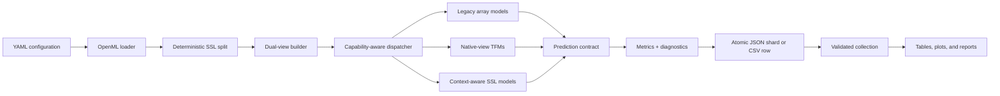

# Architecture

The project is organized around one invariant: every method must see the same
experimental split while receiving only the feature representation and data
roles that its declared capability permits.

## Configuration and data

`configs/datasets.yaml` maps stable benchmark names to OpenML identifiers and
defines the canonical `low_class_wave`. `configs/benchmark.yaml` owns label
budgets, seeds, metrics, method groups, and method defaults.

`src/data.py` loads a dataset into a typed pandas frame. `src/splits.py` creates
disjoint labeled-train, validation, unlabeled-train, and test subsets from a
single seed. Split metadata includes class coverage and sizes so low-budget
failures can be distinguished from estimator failures.

## Dual views and fit context

`src/views.py` is the boundary between data protocol and models. It builds:

- a native pandas view for TFMs that perform their own mixed-type processing;
- a fitted processed view for sklearn, tree, graph, and neural methods.

The processed transformer is fitted on labeled plus unlabeled training features,
never on validation or test features. Labels are encoded from labeled and
validation classes, not from hidden unlabeled truth.

`FitContext` carries both views plus the fixed class order, dataset identity,
seed, and label budget. Model code never needs to load data or create its own
benchmark split.

## Capability-aware dispatch

`src/method_capabilities.py` declares each method's family, input view, protocol,
device, class support, fidelity, environment, and unlabeled-data use.
`src/models/registry_ext.py` maps extended names to builders. The runner checks
the declaration before dispatch, which prevents a raw-only TFM from silently
receiving one-hot features or a transductive experiment from entering the
inductive group.

Two model protocols coexist intentionally:

- `BaseModel` preserves the original array-based interface used by historical
  methods.
- `ContextAwareModel` consumes `FitContext` for models that need raw views,
  validation guards, graphs, or explicit memory roles.

`src/models/legacy_adapter.py` bridges legacy estimators without changing their
predictions, and parity tests protect that boundary.

## SSL components

Reusable pieces live below the named estimators:

- `src/ssl_engine/` implements pseudo-label selection, class balance, calibration,
  risk guards, graphs, and collapse diagnostics.
- `src/models/sparse_graph.py` builds locally scaled sparse kNN graphs without a
  dense \(n \times n\) affinity matrix.
- `src/models/geometric_attention_ssl.py` contains batched balanced retrieval and
  the modular combined objective.
- the TFM modules pin checkpoint identity, normalize class order, and expose
  cold/warm inference metadata.

Method-specific diagnostics are returned as structured training metadata. The
runner flattens stable top-level fields and retains the full nested record for
later scientific auditing.

## Results and atomic execution

For local sequential runs, `src/run_benchmark.py` appends one CSV row after each
cell. `src/run_single.py` can write one result shard atomically for external schedulers.

The public repository is scheduler-agnostic. Users can run cells sequentially
with `src.run_benchmark` or wrap `src.run_single` in their own batch system.
Site-specific Slurm accounts, partitions, storage paths, monitoring scripts, and
credential-loading helpers are intentionally not distributed.

Report builders consume canonical CSVs rather than scheduler output. Every
public figure has a machine-readable table upstream, and the final report keeps
its report-level manifest and integrity metadata.

## Adding a method safely

1. Implement the smallest suitable model protocol under `src/models/`.
2. Declare capabilities and fidelity in `method_capabilities.py`.
3. Register construction in the appropriate registry.
4. Put hyperparameters in `configs/benchmark.yaml` rather than hidden globals.
5. Add synthetic binary/multiclass tests and a leakage or memory-role assertion.
6. Run a one-cell validation before scaling to the full benchmark grid.
7. Preserve package/checkpoint identity and every failure record.
