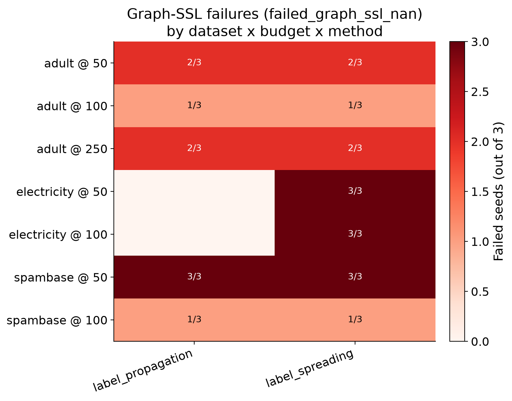
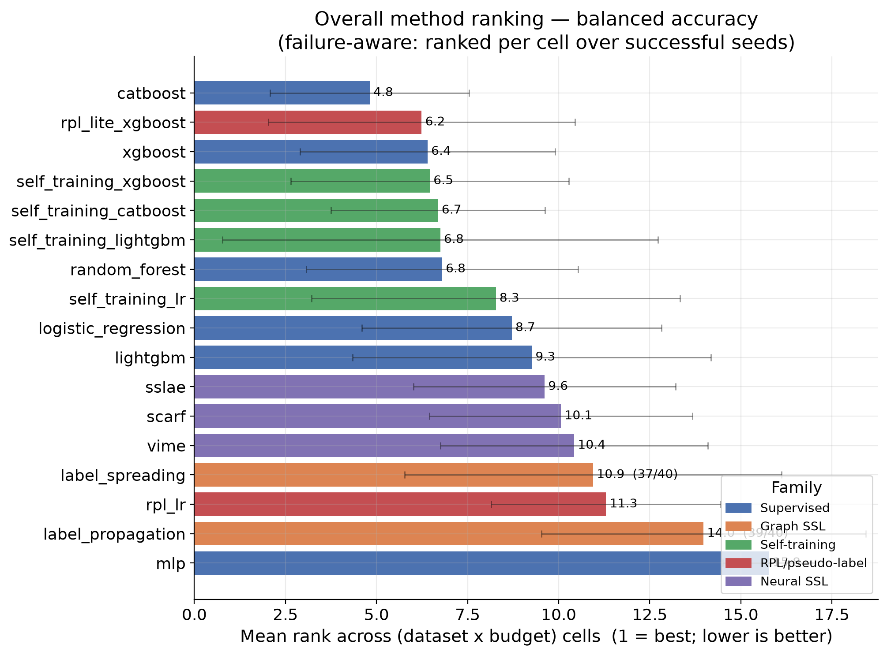
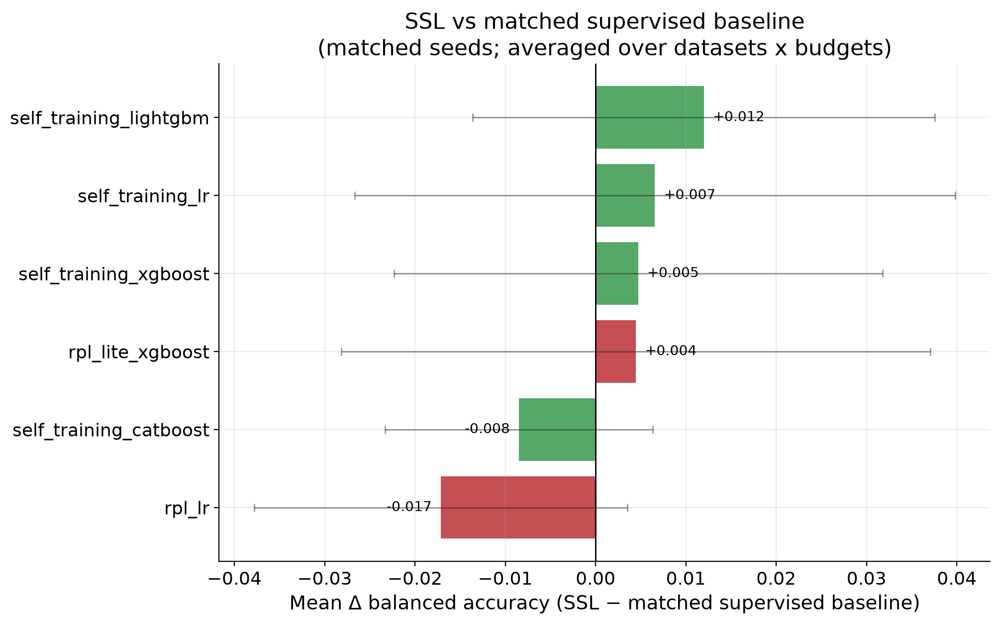
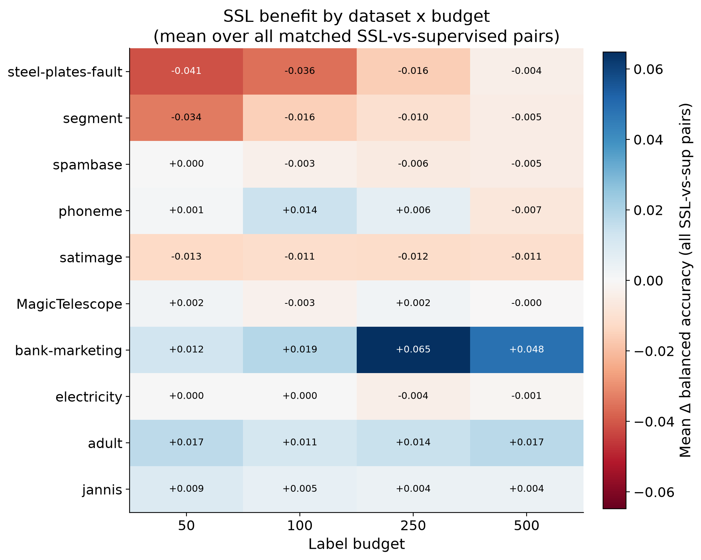
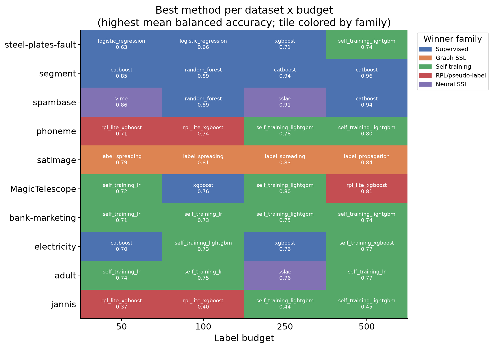
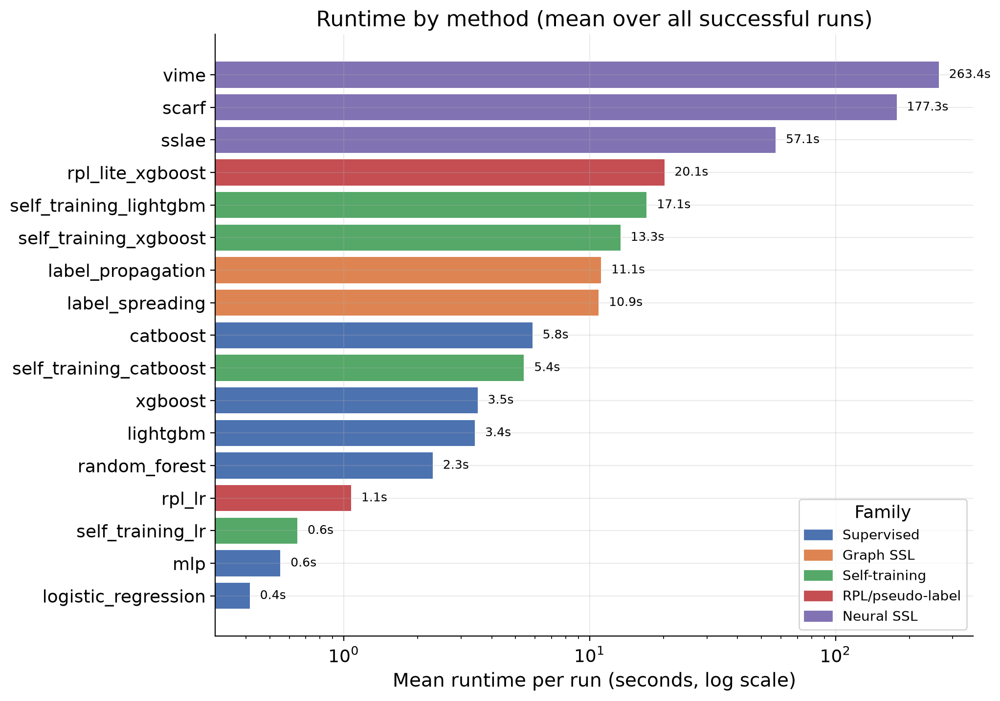
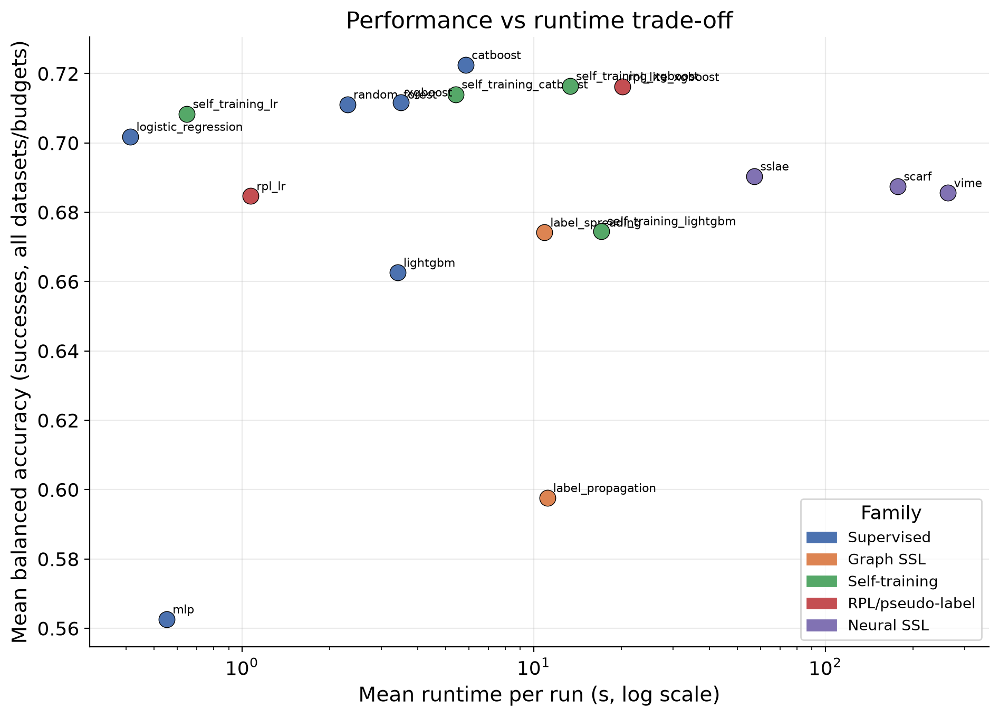

# Low-Class Wave — Exploratory SSL Benchmark on Tabular Data

*Analysis report generated from the completed canonical results
(`results/raw/low_class_wave_paper_methods.csv` and
`results/aggregated/low_class_wave_paper_methods/`). No benchmarks were rerun and
no raw files were modified.*

## 1. Context

This is the **second exploratory low-class wave** of our tabular SSL benchmark. It
covers **10 OpenML tabular classification datasets** (2 to 7 classes), **17
methods**, **4 label budgets** (50, 100, 250, 500 labeled examples) and **3 seeds**
(0, 1, 2), for a full grid of **2,040 runs**. The datasets `letter` and the method
`vime_lite` are **intentionally excluded** from this wave. Two datasets
(`phoneme`, `spambase`) are **reused** from an earlier run; the other eight were
run fresh for this wave. The goal here is to see what the data actually shows —
not to argue that SSL (or neural SSL) helps. Language throughout is deliberately
tentative: this is exploratory evidence, not final paper evidence.

**Primary metric: balanced accuracy** (mean recall across classes), chosen because
several datasets are class-imbalanced binary problems where raw accuracy is
misleading. Accuracy, macro-F1 and ROC-AUC are available in the aggregated tables
and broadly agree on the ordering; where a plot uses balanced accuracy the title
says so. Failed runs carry no metric value and are **excluded** from metric means;
rankings are computed **per (dataset × budget) cell over successful seeds** so that
methods with recorded graph-SSL failures are neither rewarded nor hard-penalized.

## 2. Data and method setup

### Datasets (ordered small → large)

| Dataset | OpenML id | ~Rows used | Features (raw→proc.) | Classes | Task | Size |
|---|---|---|---|---|---|---|
| steel-plates-fault | 40982 | 1,941 | 27 → 27 | 7 | multiclass | small |
| segment | 36 | 2,310 | 19 → 19 | 7 | multiclass | small |
| spambase | 44 | 4,601 | 57 → 57 | 2 | binary | medium |
| phoneme | 1489 | 5,404 | 5 → 5 | 2 | binary | medium |
| satimage | 182 | 6,430 | 36 → 36 | 6 | multiclass | medium |
| MagicTelescope | 1120 | 19,020 | 10 → 10 | 2 | binary | large |
| bank-marketing | 1461 | 45,211 | 16 → 51 | 2 | binary | large |
| electricity | 151 | 45,312 | 8 → 14 | 2 | binary | large |
| adult | 1590 | 48,842 | 14 → 108 | 2 | binary | large |
| jannis | 41168 | 83,733 | 54 → 54 | 4 | multiclass | large |

Large datasets are subsampled to a fixed pool for the unlabeled/graph stages (e.g.
20,000 rows for the graph-SSL neighbor graph), so "rows used" is the effective
working size, not necessarily the full OpenML table.

### Method families (17 methods)

- **Supervised (6):** `logistic_regression`, `mlp`, `random_forest`, `xgboost`,
  `lightgbm`, `catboost`
- **Graph SSL (2):** `label_propagation`, `label_spreading`
- **Self-training (4):** `self_training_lr`, `self_training_xgboost`,
  `self_training_lightgbm`, `self_training_catboost`
- **RPL / pseudo-labeling (2):** `rpl_lr`, `rpl_lite_xgboost`
- **Neural SSL (3):** `vime`, `scarf`, `sslae`

Each method is run at budgets **{50, 100, 250, 500}** with seeds **{0, 1, 2}**.

## 3. Integrity / failure summary

Programmatic verification on the canonical file (all checks pass):

| Check | Expected | Actual | OK |
|---|---|---|---|
| Total rows | 2,040 | 2,040 | ✅ |
| Datasets | 10 | 10 | ✅ |
| Methods | 17 | 17 | ✅ |
| `letter` present | no | no | ✅ |
| `vime_lite` present | no | no | ✅ |
| Rows per dataset | 204 | 204 (all 10) | ✅ |
| Duplicate keys `(dataset, method, seed, n_labeled)` | 0 | 0 | ✅ |

Status counts: **2,016 success**, **24 `failed_graph_ssl_nan`**, 0 crashes.

**All non-graph methods completed every cell** (204/204 per dataset at the
seed level for all supervised, self-training, RPL and neural-SSL methods). The
only failures are graph SSL, and they are recorded transparently as
`failed_graph_ssl_nan` rows rather than silently dropped.

The 24 failures are concentrated at **low budgets (50, 100) on large/medium binary
datasets**, where the k-NN affinity graph produced NaN outputs even after the
retry ladder `[7, 15, 30, 50, 5, 3]`:

- `electricity` / `label_spreading` @ 50 and @ 100 (all 3 seeds each → 6)
- `adult` / `label_propagation` + `label_spreading` @ 50/100/250 (10 total)
- `spambase` / `label_propagation` + `label_spreading` @ 50/100 (8 total)

Graph SSL runs fine everywhere else — notably it is the **best** family on
`satimage` (see §4). The failures therefore look like a numerical-stability issue
of the graph construction at very low label counts on large binary problems, not a
general breakage of the method. See `fig7_failures_heatmap`.

## 4. Main results

**Ranking variant used:** the headline ranking is *failure-aware mean rank* —
within each of the 40 (dataset × budget) cells we rank methods by mean balanced
accuracy over their successful seeds (1 = best), then average each method's rank
across the cells in which it ran. 37 of 40 cells contain all 17 methods; the 3
incomplete cells are the electricity/spambase low-budget graph-SSL wipeouts, and
only the two graph methods lose cells there (label_spreading ranked in 37/40,
label_propagation in 39/40). This matches the intent of the
`rankings_by_dataset_budget_complete_only` aggregation while keeping every
successful run.

**What stands out:**

- **Strong gradient-boosted trees dominate.** `catboost` is the clear top method
  (mean rank 4.8), followed by a tight pack of `rpl_lite_xgboost` (6.2),
  `xgboost` (6.4), `self_training_xgboost` (6.5), `self_training_catboost` (6.7),
  `self_training_lightgbm` (6.8) and `random_forest` (6.8). The best "SSL" methods
  are essentially **GBDT wrapped in self-training / pseudo-labeling**, and they sit
  right next to their supervised GBDT counterparts.
- **Neural SSL is mid-pack:** `sslae` (9.6), `scarf` (10.1), `vime` (10.4) — below
  the tree methods despite being 30–70× slower (§7).
- **Weakest methods:** `mlp` (15.8, by far the worst) and `label_propagation`
  (14.0). `rpl_lr` (11.3) and `label_spreading` (10.9) are also weak. Plain `mlp`
  is not competitive on these tabular problems at any budget.
- The error bars (std of per-cell rank) are wide for almost every method — with
  only 3 seeds and strong dataset heterogeneity, most rank differences inside the
  top pack are **not robust**. The safe reading is *"catboost/GBDT-family on top,
  mlp and label_propagation at the bottom, everything else clustered in between."*

### Method × dataset view

The heatmap (mean balanced accuracy over budgets and seeds) shows the results are
**driven far more by dataset than by method**. Whole columns move together:
`segment`/`spambase` are easy (~0.85–0.91 for most methods), `jannis` is hard for
everyone (~0.36–0.41), and `bank-marketing` separates methods the most. Within a
column the method spread is usually small except for two consistent losers (`mlp`,
`label_propagation`).

### Budget behaviour

All families improve monotonically with more labels, as expected. **Self-training
overtakes at 100+ labels** and has the best family-mean at 250/500 (0.740, 0.759);
**at 50 labels it is essentially tied with supervised** (0.613 vs 0.604) because
with so few labels the pseudo-labels are noisy. Graph SSL is the weakest family at
every budget in the pooled view (dragged down by the large binary datasets).
RPL/pseudo-label is a strong, stable second across budgets.

## 5. SSL vs supervised (matched-seed deltas)

Using the pre-computed matched-seed pairs
(`ssl_vs_supervised_by_dataset_budget.csv`), each SSL method is compared against its
natural supervised base learner on the **same seed/split** (e.g.
`self_training_lightgbm` vs `lightgbm`, `rpl_lr` vs `logistic_regression`).

- **The overall effect is small and close to a coin-flip.** Of 240 matched
  (method × dataset × budget) comparisons, **108 are positive and 124 negative**
  (8 exactly zero at the 50-label anchor). Mean deltas per method range only from
  **−0.017 (`rpl_lr`) to +0.012 (`self_training_lightgbm`)** in balanced accuracy.
- **Where SSL helps:** self-training on boosted/linear learners on the *large
  binary* datasets — `self_training_lightgbm` (+0.012 mean), `self_training_lr`
  (+0.007), `self_training_xgboost` (+0.005), `rpl_lite_xgboost` (+0.005).
- **Where SSL hurts:** `rpl_lr` (−0.017) and `self_training_catboost` (−0.008).
  CatBoost is already so strong that self-training its own pseudo-labels tends to
  add noise rather than signal.

The dataset × budget heatmap is the clearest story:

- **Budget:** SSL is slightly **negative at low budgets** (−0.005 @ 50, −0.002 @
  100) and slightly **positive at higher budgets** (+0.004 @ 250, +0.004 @ 500).
  The benefit grows as the labeled seed becomes reliable enough to generate good
  pseudo-labels.
- **Task type:** SSL is **positive on binary** (+0.008 mean) and **negative on
  multiclass** (−0.012). The three multiclass datasets `steel-plates-fault`,
  `segment`, `satimage` show consistently negative deltas.
- **The single biggest win is `bank-marketing`** (+0.065 @ 250, +0.048 @ 500) —
  an imbalanced binary dataset where self-training clearly exploits the unlabeled
  pool. `adult` and `jannis` are mildly positive across budgets; `steel-plates-fault`
  and `segment` are clearly negative at low budgets.

**Bottom line for §5:** In this wave SSL does **not** provide a broad, reliable
lift. It is a small, dataset-specific effect: modestly helpful for self-training on
large imbalanced *binary* problems at ≥250 labels, and mildly harmful on small
*multiclass* problems and at the smallest budgets.

### Best method per cell

Counting outright winners across the 40 cells: **Self-training 16, Supervised 12,
RPL/pseudo-label 5, Graph SSL 4, Neural SSL 3.** The most frequent single winners
are `self_training_lightgbm` (9 cells) and `catboost` (5). `satimage` is the one
dataset owned by Graph SSL at every budget, and `bank-marketing` is owned by
self-training — consistent with the delta analysis. So SSL methods *do* win the
most cells, but often by the small margins quantified in §5, and the supervised
GBDTs are rarely far behind.

## 6. Dataset-regime analysis

Family-mean balanced accuracy sliced by regime:

**By task**

| Family | Binary | Multiclass |
|---|---|---|
| Supervised | 0.707 | 0.636 |
| Graph SSL | 0.626 | 0.646 |
| Self-training | 0.735 | 0.656 |
| RPL/pseudo-label | 0.730 | 0.655 |
| Neural SSL | 0.718 | 0.642 |

**By size**

| Family | Small | Medium | Large |
|---|---|---|---|
| Supervised | 0.711 | 0.763 | 0.616 |
| Graph SSL | 0.728 | 0.735 | **0.530** |
| Self-training | 0.738 | 0.774 | 0.647 |
| RPL/pseudo-label | 0.743 | 0.772 | 0.640 |
| Neural SSL | 0.714 | 0.785 | 0.619 |

- **Binary vs multiclass:** every family is stronger on binary; the gap is largest
  for supervised and neural SSL. Graph SSL is the *only* family that is (barely)
  better on multiclass than binary — because its large-binary failures/collapses
  drag its binary average down.
- **Small vs large:** medium datasets are the "sweet spot" for all families.
  Performance drops sharply on large datasets, dominated by `jannis` (hard 4-class,
  ~0.4). **Graph SSL collapses on large data** (0.530) — this is where its NaN
  failures and low-quality large-graph solutions live.
- **Low vs higher budget:** covered in §4/§5 — self-training's advantage is a
  higher-budget phenomenon; at 50 labels there is no SSL advantage on average.
- **Dimensionality:** no clean wide-vs-narrow pattern emerged. The widest processed
  feature space (`adult`, 108 features after one-hot) behaves like the other large
  binary sets; the narrowest (`phoneme`, 5 features) is mid-pack. Feature count is
  not a strong driver here relative to dataset size and class count.

## 7. Runtime analysis

- **Neural SSL is by far the most expensive:** `vime` 263 s, `scarf` 177 s, `sslae`
  57 s mean per run — vs 3–6 s for the GBDTs and <1 s for linear models. On the
  large datasets a single `vime`/`scarf` run reaches hundreds of seconds (jannis
  `vime` peaked ~1,285 s ≈ 21 min).
- **Graph SSL is mid-cost** (~11 s mean) but with heavy tails on the large graphs.
- The self-training and RPL tree wrappers cost roughly the iteration count times
  their base learner (13–20 s).

The trade-off plot makes the practical point bluntly: **the top-left quadrant
(cheap + accurate) is owned by the GBDTs and their self-training wrappers**. Neural
SSL sits far to the right (expensive) without a corresponding accuracy gain — in
this wave it does **not** earn its 30–70× runtime cost. If compute is constrained,
`catboost` / `xgboost` (± self-training) give almost all of the achievable accuracy
at a tiny fraction of the cost.

## 8. Takeaways

- **Gradient-boosted trees are the backbone.** `catboost` and the XGBoost/LightGBM
  family (supervised or self-trained) are the most reliable methods across datasets
  and budgets. Any SSL claim should be benchmarked against these, not against `mlp`
  or linear models.
- **SSL's benefit is real but narrow and small.** It shows up mainly as
  *self-training on large, imbalanced binary datasets at ≥250 labels*
  (`bank-marketing` is the flagship, +0.05–0.065). Overall it's ~coin-flip
  (108/124 pos/neg pairs).
- **SSL tends to hurt on small multiclass data and at the smallest budget (50).**
  Pseudo-labels are too noisy there; `steel-plates-fault`/`segment`/`satimage`
  deltas are negative at low budgets.
- **Neural SSL (vime/scarf/sslae) is not competitive here** on accuracy *or*
  cost. Worth investigating whether this is a tuning/epoch-budget artifact before
  drawing conclusions — but as run, it is dominated.
- **Graph SSL is bimodal:** excellent on `satimage` (best family) yet numerically
  fragile / weak on large binary data (all 24 failures, plus a 0.53 large-data
  mean). The NaN-at-low-budget behaviour deserves a targeted fix.
- **`self_training_lightgbm` is the most frequent cell winner (9/40)** and has the
  best mean SSL delta — the single most promising SSL configuration to probe next.
- **Dataset identity dominates method choice.** Results move far more by dataset
  (jannis hard, segment/spambase easy) than by method. Conclusions must be framed
  per-regime, not as global method rankings.

## 9. Limitations and next steps

- **Exploratory, not confirmatory.** Only **3 seeds** per cell; most differences
  inside the top pack are within noise. Treat rankings as directional.
- **OpenML-only, 10 datasets.** Regime coverage is thin — one hard multiclass
  (`jannis`) heavily shapes the "large" bucket; two datasets are reused from a
  prior wave.
- **Limited per-method tuning.** Neural SSL in particular may be under-trained
  (epoch/architecture budget); its poor showing should be re-checked before being
  reported as a negative result about neural SSL in general.
- **Graph-SSL failures** at low budgets on large binary data (24 cells) mean graph
  methods are evaluated on slightly fewer cells; we handled this with failure-aware
  per-cell ranking, but a fix to the graph construction would make the comparison
  cleaner.
- **Single train/val/test protocol** with stratified labeled allocation; results
  may shift under different validation strategies.
- **Suggested next steps:** (1) fix graph-SSL NaN handling and re-run the affected
  cells; (2) a focused deeper run on `bank-marketing`/`adult` (more seeds, more
  budgets) to confirm the self-training gain; (3) sanity-check neural-SSL training
  budgets before treating their negative result as final; (4) add a couple more
  hard multiclass datasets to balance the regime coverage.

---

*Artifacts: figures in `figures/` (PNG + PDF), machine-readable summary in
`report_summary.json`, and derived tables `dataset_table.csv`,
`overall_method_ranking.csv`, `best_method_by_dataset_budget.csv`. Regenerate with
`python scripts/build_low_class_wave_report.py`.*
