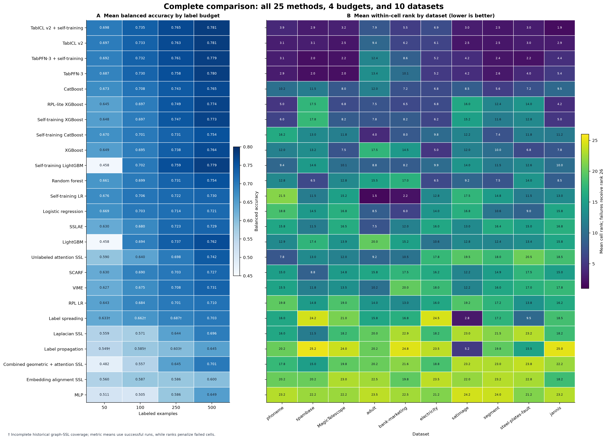
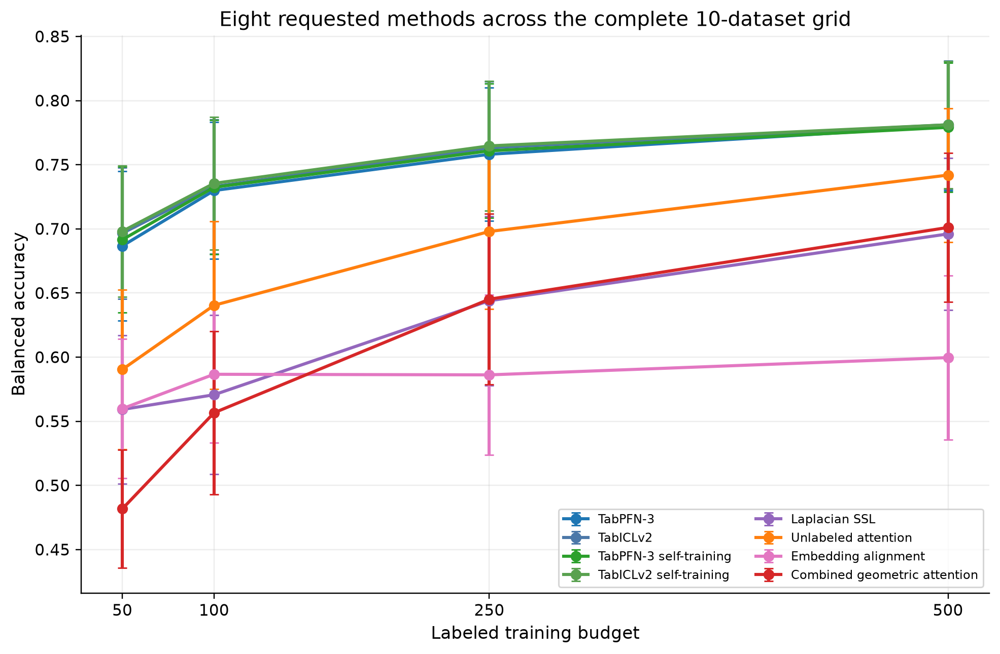
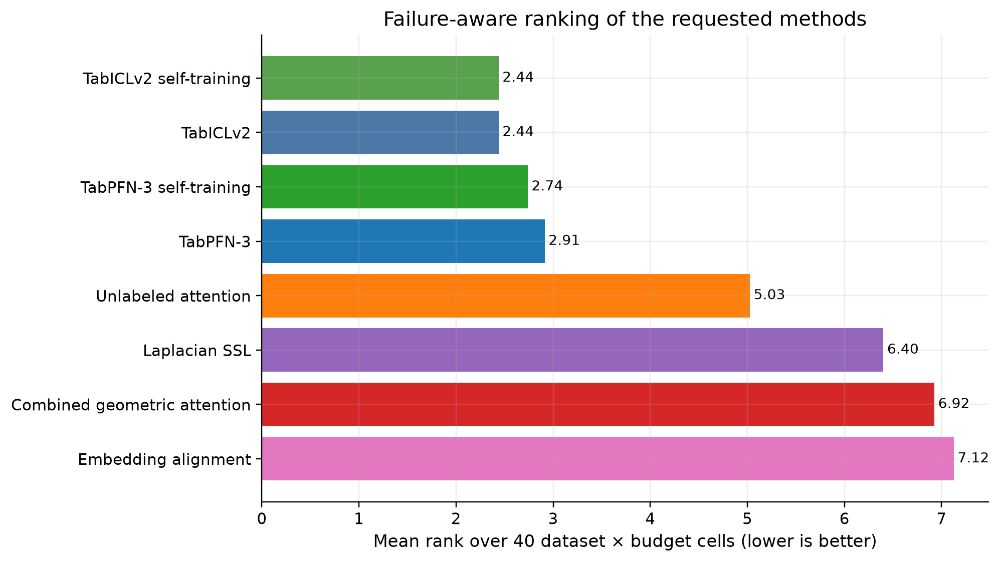
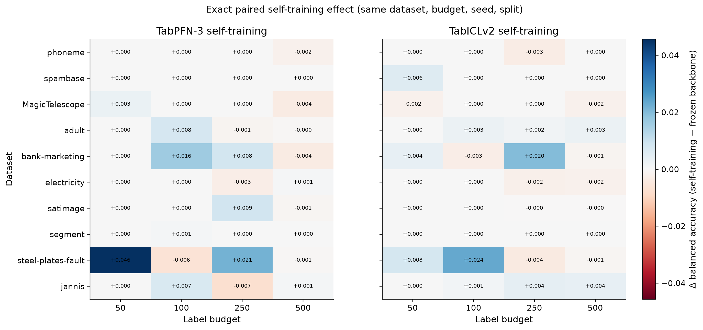
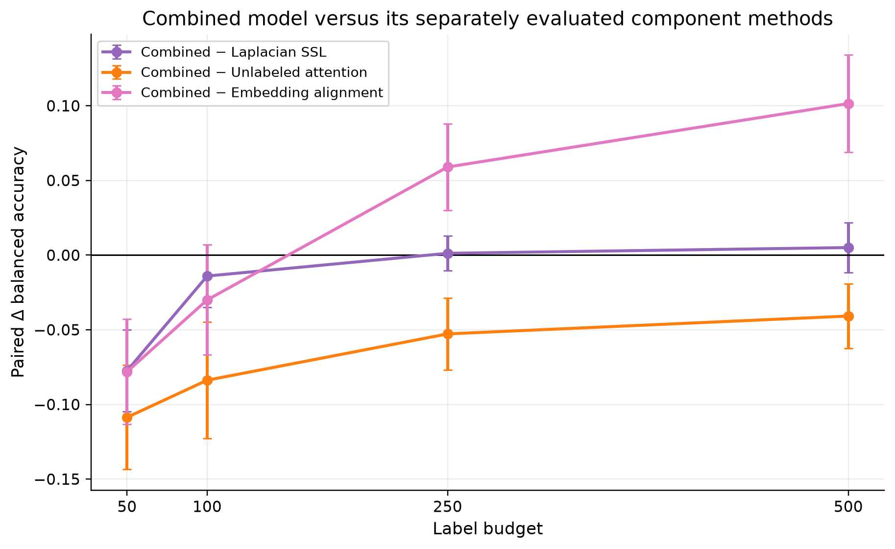
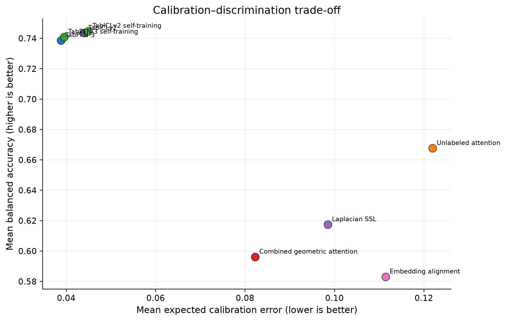
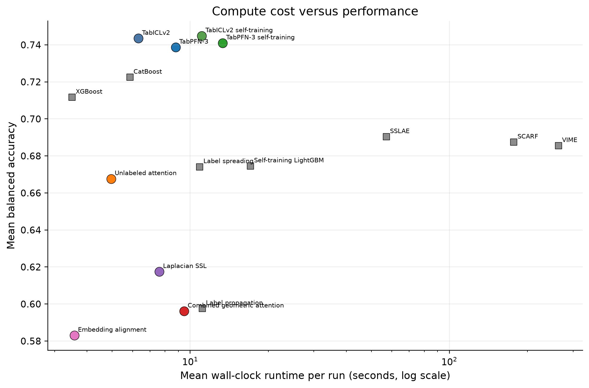
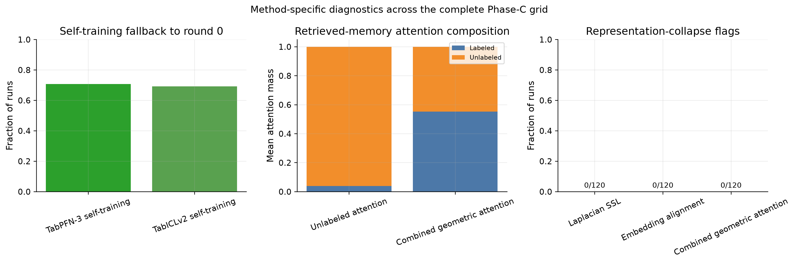
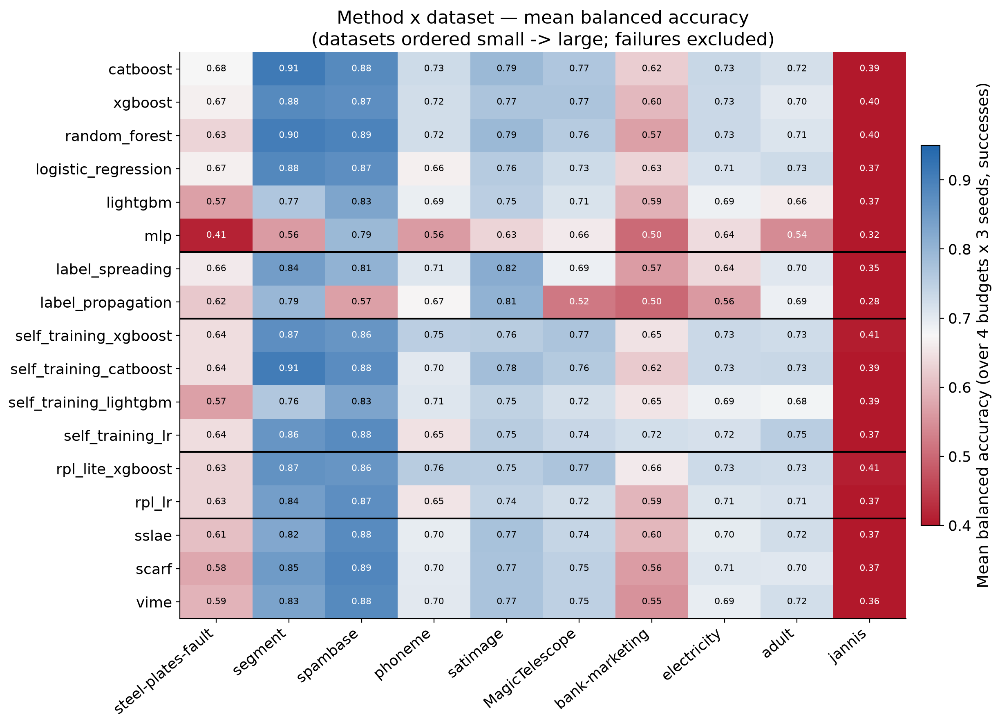
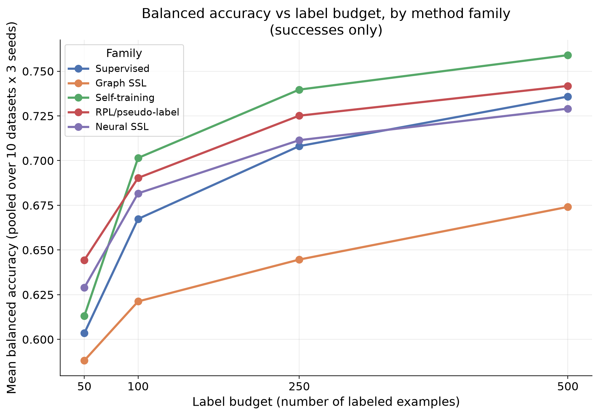

# Comprehensive report: tabular foundation models and semi-supervised learning

Consolidated on 2026-08-10 from the validated historical benchmark, frozen
foundation-model screen, and focused SSL study. This is the repository's only
canonical report; supporting figures, tables, and validation metadata live below
this directory.

## Whole-project overview

The complete evidence base contains **25 methods**, **10 datasets**, **4 label
budgets**, **3 seeds**, and **3,000 canonical rows**. Of those runs, **2,976
succeeded** and **24 preserved failures** belong to the historical graph-SSL
wave. The overview below combines the immutable historical benchmark, frozen
TabPFN-3/TabICLv2 screen, and focused SSL phase without mixing in exploratory or
superseded waves.

The corresponding machine-readable summaries are in
[`tables/overview/`](tables/overview/).

## Executive summary

The benchmark scope is complete. The frozen-TFM block contains **240/240** successful
runs and the focused-SSL block contains **720/720** successful runs. There are no missing or duplicate keys and no non-finite primary balanced-
accuracy values. The immutable 17-method historical result file was read for
comparison and was not modified.

Across the eight focused methods, **TabICLv2 self-training** has the
highest pooled mean balanced accuracy (0.745).
This pooled mean is descriptive; the primary ranking in
`tables/focused_ssl/new_method_failure_aware_ranking.csv` averages ranks over the 40 dataset ×
budget cells so large datasets cannot dominate by row count.

TabPFN-3 minus TabICLv2 has an exact paired mean balanced-accuracy difference of
**-0.005** across 120 matched cells
(descriptive 95% interval -0.009 to
-0.000).

The principal self-training effects, computed against each method's own frozen
backbone on the same dataset, budget, seed, and split, are:

| Method | Mean Δ BA | 95% low | 95% high | Positive fraction | Pairs |
|---|---|---|---|---|---|
| tabiclv2_self_training | 0.001 | 0.000 | 0.003 | 0.192 | 120 |
| tabpfn3_self_training | 0.002 | -0.000 | 0.005 | 0.167 | 120 |

These intervals describe across-cell variability; with only three seeds they are
not a basis for strong significance claims.

## Objective and scope

The study evaluates TabPFN-3 and TabICLv2 in the existing few-shot protocol, then
tests precisely six focused SSL methods: TFM self-training for both backbones,
explicit Laplacian regularization, retrieval attention using unlabeled training
memory, class-conditional embedding alignment, and their modular combined model.
No additional foundation-model families are included in the canonical benchmark.

## Protocol

- Ten canonical OpenML datasets; budgets 50, 100, 250, and 500; seeds 0, 1, and 2.
- Balanced accuracy is primary. Macro-F1, accuracy, log-loss, ROC-AUC, average
  precision where defined, Brier score, ECE, runtime, and peak GPU memory are
  retained in machine-readable tables.
- Splits are predetermined and shared across methods.
- The protocol is inductive: graph, pseudo-label, representation, and retrieval
  adaptation use labeled and unlabeled *training* rows only. Validation labels are
  restricted to calibration/selection; test features appear only at prediction.
- TabPFN-3 and TabICLv2 use the native/raw pandas view. Classical and trainable
  neural SSL methods use the established processed view.
- Long-running experiments were executed as independent benchmark cells.

The dataset inventory is in `tables/focused_ssl/dataset_table.csv`.

## Implementation fidelity

- `tabpfn3` uses TabPFN 8.1.0 with the verified V3 classifier checkpoint; `tabiclv2`
  uses the pinned `tabicl-classifier-v2-20260212.ckpt`.
- Both self-training methods share the same deterministic, class-balanced hard
  pseudo-label engine with validation selection and safe frozen-round fallback.
- `laplacian_ssl` is an explicit sparse graph-regularized neural classifier, not
  sklearn label propagation.
- `unlabeled_attention_ssl` records `labeled_plus_unlabeled` memory and zero
  validation/test-memory flags.
- `embedding_alignment_ssl` uses confidence-filtered class prototypes and records
  class geometry/collapse diagnostics.
- `geometric_attention_ssl` combines the benchmark components with ramp-up. The
  original segment chance collapse was traced to unlabeled-pool cardinality
  overwhelming top-k retrieval. Balanced labeled/unlabeled neighbor retrieval was
  implemented before the final focused-SSL grid.

## Frozen TFM results

The full frozen-TFM metric table is `tables/focused_ssl/new_method_metric_summary.csv`; the exact
TabPFN-3/TabICLv2 paired comparison is
`tables/focused_ssl/phase_a_tabpfn3_vs_tabiclv2.csv`. Figure 1 shows both frozen models beside
the six SSL methods at every budget.

## TFM self-training

Exact seed-level pairs are in `tables/focused_ssl/self_training_seed_level_paired.csv`.
Self-training selected the frozen round (round 0) in
**0.708** of TabPFN-3 runs and
**0.692** of TabICLv2 runs. This is
intended safety behavior: an attempted pseudo-label round is retained only when
validation evidence meets the fixed guard. Round logs and accepted counts are in
`tables/focused_ssl/phase_c_run_diagnostics.csv`.

The run payloads do not consistently expose post-training oracle pseudo-label
accuracy, confidence distributions, or class-prior drift as flat analyzable
fields. The report therefore does not invent those summaries; this is recorded as
a limitation even though selection counts, rounds, and fallback reasons are
preserved.

## Laplacian SSL

The method completed 120/120 cells. Sparse graph node/edge counts, connected
components, isolated-node counts, affinities, and graph-build times are summarized
in `tables/focused_ssl/method_diagnostic_summary.csv`. Exact comparisons with the existing
label-propagation and label-spreading results are in
`tables/focused_ssl/laplacian_vs_historical_graph_effects.csv`. Those comparisons share run
keys and splits but compare different estimators, so they are benchmark contrasts,
not an isolated Laplacian-loss causal effect.

Neighbor-label purity was not serialized in the final shards and is consequently
not reconstructed using test labels.

## Attention over unlabeled data

`unlabeled_attention_ssl` completed 120/120 cells with training-only
labeled-plus-unlabeled memory. Attention mass and memory sizes are in the
diagnostic tables and Figure 7. The complete grid does not contain a matched
supervised/labeled-memory control under the final source hash. The earlier control
experiments are therefore treated only as diagnostic evidence; no full-grid causal
claim that unlabeled memory helped is made.

## Class-conditional embedding alignment

`embedding_alignment_ssl` completed 120/120 cells. Per-run reliable-unlabeled
counts, embedding variance, intra-class distance, inter-prototype distance, and
collapse flags are retained in `tables/focused_ssl/phase_c_run_diagnostics.csv`. Relations
between these diagnostics and balanced accuracy can be analyzed from that table
without conflating uncertain examples with accepted examples.

## Combined model and component contrasts

The combined method completed 120/120 cells. It recorded
**0** representation-collapse flags and **21**
constant-prediction flags across the final grid. A constant-prediction diagnostic
is a warning, not an automatic failed run; each affected result still has finite,
normalized probabilities and is retained transparently.

Paired differences between the complete combined method and the separately trained
Laplacian, attention, and alignment methods are:

| Component comparator | Mean combined − component | 95% low | 95% high | Positive fraction | Pairs |
|---|---|---|---|---|---|
| embedding_alignment_ssl | 0.013 | -0.008 | 0.034 | 0.550 | 120 |
| laplacian_ssl | -0.021 | -0.033 | -0.010 | 0.325 | 120 |
| unlabeled_attention_ssl | -0.072 | -0.087 | -0.056 | 0.142 | 120 |

These are component-method contrasts, not leave-one-component-out ablations.

## Calibration and secondary metrics

`tables/focused_ssl/new_method_metric_summary.csv` reports all benchmark metrics with valid
sample counts. Average precision is undefined for the benchmark's multiclass
cases and is left missing rather than imputed. Figure 5 displays the mean ECE/
balanced-accuracy trade-off. Log-loss, Brier score, and ECE are interpreted as
calibration context; no method is selected using test calibration metrics.

## Focused-study figures

These seven figures are the non-redundant visual record for the frozen-TFM and
focused-SSL blocks. PNG is the single canonical figure format in this report.

## Comparison with the historical benchmark

`tables/focused_ssl/requested_methods_and_historical_baselines.csv` compares all eight focused
methods with CatBoost, XGBoost, self-training LightGBM, label propagation,
label spreading, VIME, SCARF, and SSLAE. The failure-aware ranking and explicit
coverage tables prevent a method with missing runs from being silently rewarded.
Historical results remain immutable at
`results/raw/low_class_wave_paper_methods.csv`.

### Historical benchmark findings

The historical wave contributes 17 of the 25 canonical methods. Its main result
is robust at the family level: gradient-boosted trees and their self-training or
pseudo-label wrappers dominate, while plain MLP and label propagation are at the
bottom. Differences inside the leading tree-method group are less secure because
only three seeds were run and datasets are heterogeneous.

Matched-seed comparisons show that SSL's average effect is small and
regime-dependent. It is most useful for self-training on larger imbalanced binary
datasets at 250 or 500 labels, and tends to hurt on small multiclass data or at
the 50-label budget. Neural SSL is much slower without a consistent accuracy
gain. Historical graph SSL is bimodal and accounts for all 24 preserved failures.

The historical ranking, dataset inventory, best-per-cell table, and analysis
summary are retained in [`tables/historical/`](tables/historical/). Only the canonical summary tables and figures are retained in this public repository.

## Compute cost

Runtime and peak GPU memory are summarized per method in the metric table.
Figure 6 compares mean runtime and balanced accuracy on a logarithmic runtime
axis. CPU RAM was not serialized by the benchmark runner, so the requested RAM
comparison cannot be reconstructed reliably and is reported as unavailable.
Cold-load and warm-inference timing remain in the raw TFM rows.

## Failure analysis

Operationally, the frozen-TFM and focused-SSL blocks have zero failed, missing,
corrupt, or duplicate runs. During development, an early combined-model collapse
on segment was traced to retrieval composition; balanced labeled/unlabeled
retrieval was used in the final grid. Historical graph-method failures remain
preserved in the canonical historical CSV.

Run `python -m pytest -q` to validate the current checkout.

## Limitations

1. Three seeds support paired descriptive uncertainty, not strong significance
   claims about small differences.
2. Trainable SSL methods lack a final-hash, full-grid supervised encoder control;
   component and historical comparisons must not be described as the pure effect
   of unlabeled data.
3. Some analysis-only diagnostics—CPU RAM, post-training pseudo-label
   accuracy, neighbor-label purity, and flattened class-prior drift—were not
   serialized consistently.
5. The attention and alignment models are novel experimental implementations,
   not claims of reproduction of a named published algorithm.

## Conclusions

The benchmark scope is complete and reproducible: 960 foundation-model/focused-SSL
runs, plus comparisons to the immutable historical benchmark. The strongest defensible claims are the complete-grid
method rankings and the exact paired self-training effects. The geometric family
is now operational and non-collapsed at the representation level, but its
unlabeled-data benefit should remain qualified because a full-grid matched
supervised control was not run. 

## Deliverable index

- Canonical frozen-TFM block: `results/raw/tfm_frozen_screen.csv`
- Canonical focused-SSL block: `results/raw/focused_tfm_ssl.csv`
- Whole-project summary tables: `tables/overview/`
- Focused-study tables: `tables/focused_ssl/`
- Historical summary tables: `tables/historical/`
- Canonical figures (PNG): `figures/`
- Report integrity metadata: `validation/`
