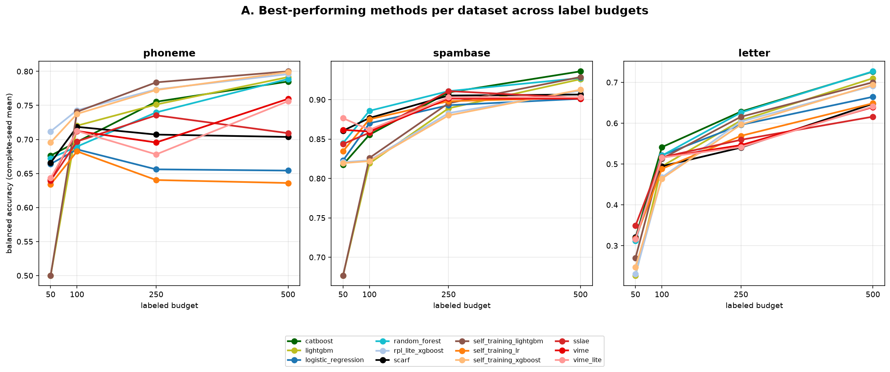
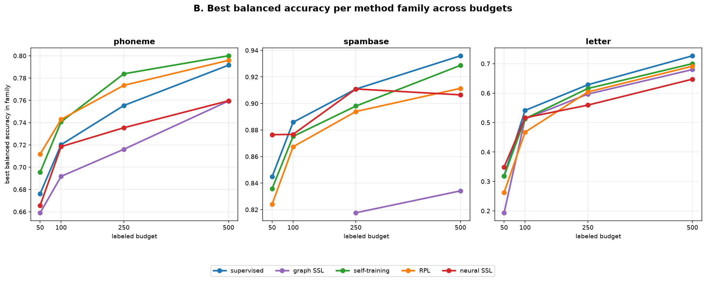
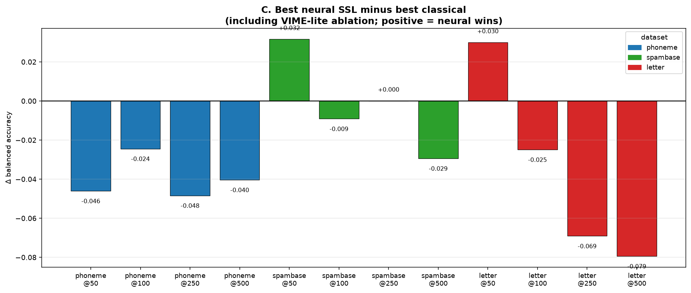
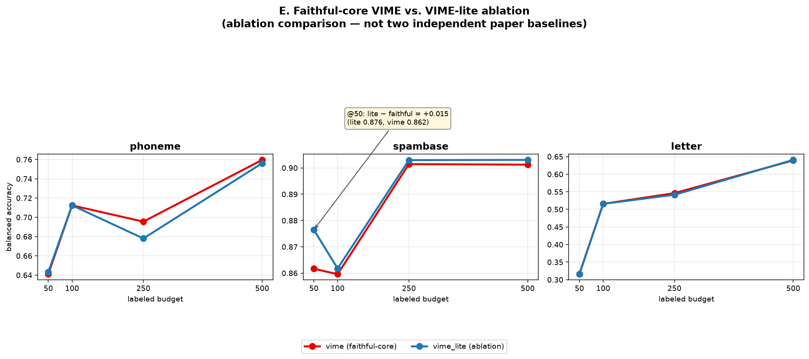
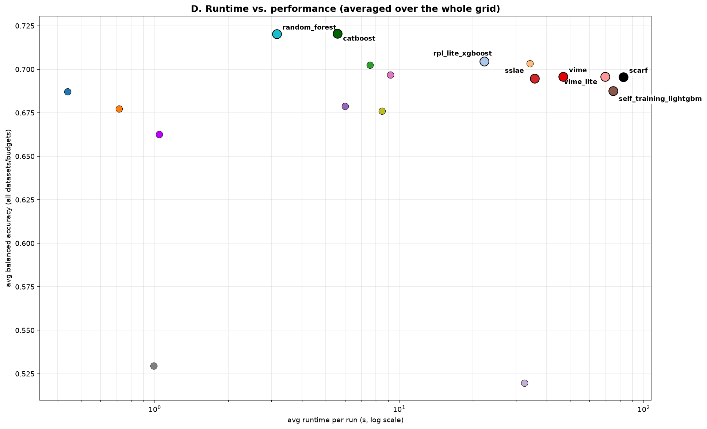

# First-wave tabular SSL benchmark — exploratory results

*First-wave exploratory benchmark only — not final paper evidence. Intended to orient the next round of work.*

**Objective:** The goal is not to make final paper claims, but to identify which method families and dataset regimes are worth deeper investigation.

## 1. Setup

- **Datasets** (OpenML, mostly numeric — **3 datasets only** in this wave):
  - `phoneme` — ~5,404 rows, 5 features, **binary**.
  - `spambase` — ~4,601 rows, 57 features, **binary** (widest feature space here).
  - `letter` — ~20,000 rows, 16 features, **26-class multiclass** (hardest).
- **Label budgets** (absolute # labeled): 50, 100, 250, 500.
- **Seeds:** 0, 1, 2 (each cell is a 3-seed mean).
- **Methods (18):** supervised baselines, graph SSL, self-training, RPL, and neural SSL (`sslae`, `scarf`, **vime** = faithful-core VIME, **vime_lite** = earlier lightweight VIME-inspired ablation).
- **Fixed shared sklearn preprocessing** for all methods; **limited / no per-method hyperparameter tuning** (conservative defaults). **648 runs total.**
- Headline numbers use **balanced accuracy** on **complete-seed** cells (all 3 seeds succeeded). `macro_f1` tracks balanced accuracy closely and does not change any interpretation below.

## 2. Overall takeaways (blunt, directional)

1. **Strong supervised baselines tend to win most cells.** catboost and random_forest are the top average performers; no SSL method beats them broadly. SSL looks situational, not a free win.
2. **Neural SSL appears competitive mainly on `spambase` at low labels.** On `phoneme` and `letter` it trails classical methods, often by a noticeable margin on `letter` (−0.07 to −0.08 balanced accuracy at higher budgets).
3. **Unlabeled data helps modestly and inconsistently.** Tree-based self-training / RPL show small positive deltas on `phoneme`; elsewhere SSL is roughly equal to or below its supervised backbone.
4. **Faithful `vime` did not beat the `vime_lite` ablation on its headline cell** (`spambase@50`: vime 0.862 vs vime_lite 0.876). Both beat the best classical there, so a VIME-family low-label signal is plausible but small — and the faithful version did not improve on the ablation in this wave.
5. **Neural methods cost 10–150× the runtime of the best classical baselines** without a consistent accuracy gain; graph SSL fails at the lowest label budgets on `spambase`. With only 3 seeds, 3 datasets, and tiny label budgets, treat all deltas as **directional**, not definitive.

### Headline winners (complete-seed balanced accuracy)

| dataset | budget | best method | family | balanced accuracy | note |
|---------|--------|-------------|--------|-------------------|------|
| phoneme | 50 | rpl_lite_xgboost | rpl | 0.712 | |
| phoneme | 100 | rpl_lite_xgboost | rpl | 0.743 | |
| phoneme | 250 | self_training_lightgbm | self_training | 0.784 | |
| phoneme | 500 | self_training_lightgbm | self_training | 0.800 | |
| spambase | 50 | vime_lite | neural_ssl | 0.876 | ablation; faithful vime 0.862 |
| spambase | 100 | random_forest | supervised | 0.886 | |
| spambase | 250 | sslae | neural_ssl | 0.911 | ~tie with best classical |
| spambase | 500 | catboost | supervised | 0.936 | |
| letter | 50 | sslae | neural_ssl | 0.349 | fragile — label_spreading incomplete |
| letter | 100 | catboost | supervised | 0.541 | |
| letter | 250 | catboost | supervised | 0.628 | |
| letter | 500 | random_forest | supervised | 0.727 | |

## 3. Dataset-level observations

**phoneme** (binary, 5 features)
- Wins: tree-based RPL / self-training (see table).
- Unlabeled data **may help**: tree self-training / RPL beat their supervised backbones (e.g. rpl_lite_xgboost +0.05 over xgboost at 50).
- Promising direction: tree-based pseudo-labeling. Weak so far: neural SSL and `mlp`.

**spambase** (binary, 57 features)
- Wins: `vime_lite` @50 (ablation), `random_forest` @100, `sslae` @250, `catboost` @500.
- Unlabeled data **may help at the lowest budget**: neural SSL beats classical at 50 (vime_lite +0.032, faithful vime +0.017). The gap shrinks by 100+ labels.
- Promising direction: VIME-family + sslae in low-label, wide-feature binary data. Weak: graph SSL (NaN failures at 50/100).

**letter** (26-class, multiclass)
- Wins: `catboost` (100/250) and `random_forest` (500); `sslae` is nominally top at 50 **but fragile** — stronger `label_spreading` (0.373 on 2 good seeds) is excluded for an incomplete seed.
- Unlabeled data **does not appear to help**: SSL ≈ or < supervised; neural trails by up to ~0.08 at higher budgets.
- Likely too few labels per class (50–500 over 26 classes).

## 4. Neural SSL observations

- **sslae** (autoencoder-style baseline): most consistent neural method; competitive on some `spambase`/`letter` cells, but rarely beats classical.
- **scarf** (faithful-core SCARF): middle of the pack and among the **slowest** (~83 s/run avg); no clear accuracy payoff in this wave.
- **vime** (faithful-core VIME): beats best classical at `spambase@50`, but **does not beat `vime_lite`** on that cell and trails classical elsewhere.
- **vime_lite** (lightweight ablation): strongest neural cell (`spambase@50`). Useful for comparison — **not full VIME**; any VIME-related claim should reference faithful `vime`.
- **Is neural SSL useful in this first wave?** Only in a narrow regime — low-label, wide-feature binary (`spambase`). Not yet a general recommendation given runtime.
- **Does faithful vime change the story vs vime_lite?** Not really. It supports a plausible VIME-family signal at `spambase@50` without exceeding the ablation.

*Figure A: Top methods per dataset across budgets. Notice that winners shift with budget — tree methods dominate at higher labels; neural methods only lead on `spambase` at 50 (vime_lite ablation). Colors are consistent across panels.*

*Figure B: Best method within each family per dataset. Supervised and self-training/RPL families are strongest overall; neural SSL only approaches parity on `spambase`.*

*Figure C: Best neural SSL minus best classical per cell (includes vime_lite ablation in the neural pool). Only `spambase@50` and a fragile `letter@50` cell are clearly positive. A faithful VIME-only comparison is discussed separately (Figure E).*

*Figure E: Ablation comparison — faithful-core `vime` vs `vime_lite` (not two independent paper baselines). At `spambase@50` the ablation leads by +0.015 balanced accuracy.*

## 5. Runtime and failures

- **Fast + strong:** logistic_regression (0.4 s), random_forest (3 s), catboost (5.6 s) — best accuracy/runtime trade-off in this wave.
- **Slow:** scarf (~83 s), self_training_lightgbm (~75 s), vime_lite (~69 s), vime (~47 s), sslae (~36 s).
- **Failures:** 9 `failed_graph_ssl_nan` runs — graph SSL on `spambase` @50/100 and one `label_spreading` seed on `letter`@50. Recorded cleanly; unlikely to change the main story (graph SSL was not competitive where it ran).
- **Local runs feasible?** Yes — CPU-only; full grid is tractable, though neural methods add wall-clock time.

*Figure D: Average runtime (log scale) vs average balanced accuracy. Classical tree models sit in the best corner; neural SSL and some self-training variants are much slower without a matching accuracy gain.*

## 6. Should we add more datasets now?

**Recommendation: not before the supervisor meeting.** Three datasets already support a clear, honest story for a first wave. Adding datasets now would delay the meeting and risk a half-finished comparison. Better to present this wave and let the supervisor steer what to scale next. Keep a short candidate list ready (below) to discuss live.

## 7. Suggested next steps

1. **Probe the `spambase` low-label signal** — more seeds and extra low budgets (e.g. 25/50/75) to test whether the VIME/sslae advantage is robust or noise.
2. **Add one larger binary dataset** (more unlabeled data, wide features) to see if neural SSL benefits from scale where spambase hinted.
3. **Add one harder multiclass dataset** to stress-test SSL beyond `letter` — but expect neural to struggle at low labels.
4. **Double down on tree-based self-training / RPL on phoneme-like data**, the most consistent place unlabeled data helped.
5. **Run a selected subset (not all 18 methods) on larger data** to control compute — deprioritize slow methods with weak first-wave signal in broad sweeps, while keeping them available for targeted checks.
